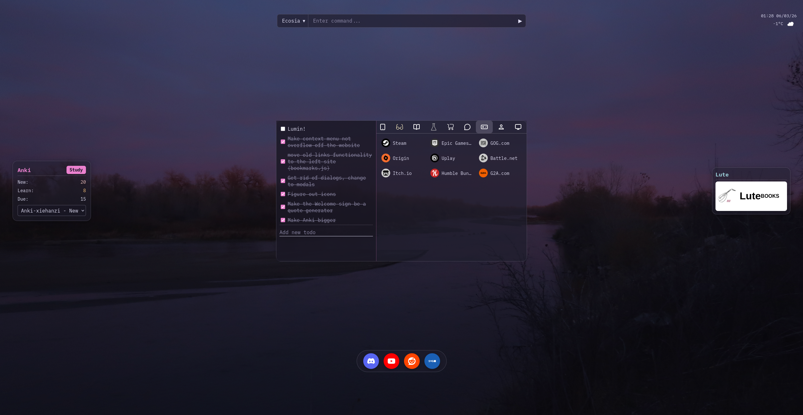

# Lumin Startpage
 The first project i tried vibecoding. It's meant to function as a browser homepage and a new tab.

 ## Features
 - Current weather
 - Todo list
 - Bookmarks
 - Ability to sync with MacOS's Safari (needs to be set up by user) 
 - A searchbar with multiple search engines to choose
 - Ability to send message to a discord channel via webhooks 
 - No JS frameworks or Node packages
  
    ### 1.1 Changelog
    - Added Anki with support for [Anki-xiehanzi deck](https://github.com/krmanik/Anki-xiehanzi) and [Learning using Texts (Lute)](https://github.com/Felix-1871/lute-v3) to facilitate language learning
    - Changed a bit of styling
## Sync
 The site will refresh links every hour, but you can refresh anytime you want using right click context menu. There are two types of syncing, full sync (will overwrite everything), or interactive sync where you will be prompted each time there's a conflict.
 It will try to automatically choose an icon and adapt the colour from simple-icons

 ## Setup
 1. Download simple-icons set and add icons directory to /img
 2. For Anki, download Anki client and install Anki Connect plugin
 3. For Lute, download and run
 4. Both Anki and Lute must run in background for the respective modules to work!

    ### How to set up the Safari sync
    I'm using Safari's tab groups a lot, so I can have many tabs open without clutter, however it doesn't offer syncing outside the Apple's ecosystem and I don't like using 3rd party tools out of privacy concerns (yeah AI and privacy doesn't seem too close but at least there I have some resemblance of control over it).
    Firstly, retrieve tabs from Safari to scheme [{group_title},{tab_title},{tab_url}]. I use the following command
    ```
    sqlite3 -json /Users/<username>/Library/Containers/com.apple.Safari/Data/Library/Safari/SafariTabs.db "SELECT g.id AS group_id, g.title as group_title, t.title as tab_title, t.url as tab_url from bookmarks g LEFT JOIN bookmarks t on t.parent = g.id and t.type = 0 where g.type = 1 and t.url is not null and trim(t.url) <> '' order by g.title, t.id;" > <the directory of your choosing>/tabs.json
    ```
    You can automate the process by using cron or shortcuts. To use this data just put tabs.json in the project directory.


# Screenshot
